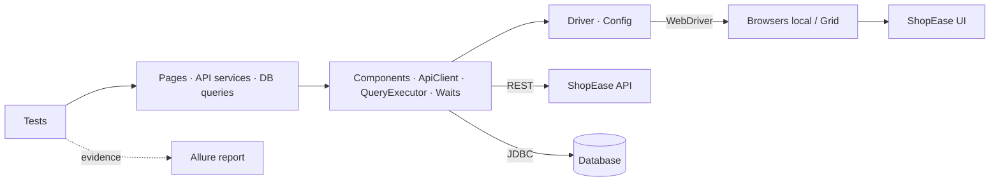

# Enterprise Test Automation Framework

[](https://github.com/niranjankagri/enterprise-test-automation-framework/actions/workflows/regression.yml)
[](https://github.com/niranjankagri/enterprise-test-automation-framework/actions/workflows/nightly.yml)
   

## Overview

A production-style QA automation platform: UI, API and database testing of one application, with parallel execution, a resilience policy, an evidence-rich Allure report, Docker + Selenium Grid and GitHub Actions pipelines.

It tests **ShopEase Admin** ([`demo-app`](demo-app/README.md)), a small shop back office kept in this repository, so the same business record can be checked through the UI, the REST API and the database.

New here? Read the **[complete framework guide](docs/FRAMEWORK-GUIDE.md)**.

Companion repository: [selenium-java-framework](https://github.com/niranjankagri/selenium-java-framework), an interview-focused Selenium lab. This repository is the engineering side: architecture, scale and delivery.

## Objectives

- Validate behaviour at the cheapest level (API), and consistency across UI, API and database.
- Independent, data-owning, parallel-safe tests: no order dependencies, no shared fixtures, no sleeps.
- Every failure explains itself: steps, request/response, rows, screenshot, log, environment, build.
- Same tests everywhere: laptop, Docker, Selenium Grid, CI, configured, never edited.

## Architecture



Layers depend downwards only; tests contain no Selenium, HTTP or SQL. Full description, diagrams and 15 architecture decision records: [docs/architecture.md](docs/architecture.md).

## Technology stack

| Area | Tools |
|---|---|
| Language / build | Java 17, Maven (multi-module) |
| Test runner | TestNG 7.12 (groups, suites, listeners, data providers) |
| UI | Selenium 4.50 (local, Selenium Grid) |
| API | REST Assured 6, Jackson, JSON Schema validation |
| Database | JDBC (H2), parameterized queries |
| Assertions | AssertJ |
| Test data | Datafaker, JSON and CSV files |
| Logging | SLF4J + Logback (per-thread, per-test context) |
| Reporting | Allure 3 (allure-testng) |
| Containers | Docker, docker compose, Selenium Grid (hub + Chrome/Firefox/Edge nodes) |
| CI/CD | GitHub Actions, Dependabot, dependency review, Checkstyle |

## Project structure

```text
enterprise-test-automation-framework/
├── pom.xml                         parent POM: all versions, compiler settings
├── demo-app/                       application under test: UI + REST API + H2 (JDK HTTP server)
├── automation/
│   ├── src/main/java/.../automation
│   │   ├── config                  layered immutable configuration
│   │   ├── driver                  browser options, factory, one browser per thread
│   │   ├── ui (+ components, pages) waits, actions, component and page objects
│   │   ├── api (+ models, services) client, records, one service per resource
│   │   ├── db                      connection, queries, assertions
│   │   ├── data                    records, generators, factory, readers, clean-up
│   │   ├── listeners               settings, retry, diagnostics, metadata, evidence
│   │   ├── reporting               report steps, log capture, Allure run files
│   │   └── utils                   waits, screenshots, failure classification
│   └── src/test
│       ├── java/.../tests          api, ui, db, integration, e2e, platform, base
│       └── resources               suites/*.xml, testdata/*, schemas/*, allure.properties
├── config/checkstyle.xml           code-quality gate
├── docker/                         Dockerfile, docker-compose.yml
├── docs/                           architecture, design, strategy, CI/CD, ...
└── .github/                        workflows, Dependabot
```

## UI automation

Page Objects composed of Component Objects (`TableComponent`, `ModalComponent`, `ToastComponent`, `HeaderComponent`, `NavigationComponent`); `data-testid` locators defined once; explicit waits only, on the application's real state (`body[data-ready]`, loader); one fresh browser per test.

```java
CheckoutPage checkout = loginAsAdmin().navigation().openProducts()
        .addToCart("Wireless Mouse")
        .header().openCart();
assertThat(checkout.total()).isEqualTo("$49.00");
```

## API automation

`Test → ApiSession → Service → ApiClient → REST API`. Raw responses for status/header/error checks, typed records for happy paths, strict JSON schemas, bearer tokens per account.

```java
CustomerResponse created = ApiSession.admin().customers().createCustomer(TestDataFactory.newCustomer());
ErrorResponse error = ApiAssertions.error(expectStatus(ApiSession.viewer().customers().create(body), 403));
```

Covers GET/POST/PUT/PATCH/DELETE, 200/201/204/400/401/403/404/405/409, headers, payloads, authentication, authorization, validation and business rules (stock, order status flow).

## Database validation

```java
assertRow(db.customerByEmail(email), "customer " + email).hasValue("city", "Pune").hasValue("status", "ACTIVE");
```

API → DB (stored exactly as sent, transactions, password hashing) and UI → API → DB consistency. Environments without database access skip these tests with a reason.

## Test data management

`TestDataFactory.newCustomer()` (unique and valid, Datafaker + run-unique suffix), variants with `withEmail(...)`, reference data from `testdata/products.json`, negative cases from CSV shared by UI and API tests. Every test registers the removal of what it creates (`CleanupRegistry`); setup and clean-up of UI tests go through the API.

## Configuration

System property → environment variable → `config/<env>.properties` → `config/default.properties`.

| Setting | Values (default) |
|---|---|
| `env` / `ENV` | `local` (starts the app), `qa`, `staging` |
| `browser` | `chrome`, `firefox`, `edge` |
| `headless` | `true` / `false` |
| `execution` | `local`, `remote` (Selenium Grid at `grid.url`) |
| `parallel`, `threads` | `classes`, `2` |
| `retry.count` | `1` (infrastructure failures only) |
| `base.url`, `api.base.url`, `db.url` | per environment |
| `ADMIN_PASSWORD`, `VIEWER_PASSWORD`, `DB_*` | secrets: environment variables only (see `.env.example`) |

Invalid values stop the run at start-up with the list of valid ones.

## Parallel execution

`mvn test -Dthreads=4`. One browser per thread, unique data, per-thread clean-up and logs. Full suite: ~186 s serial, ~132 s with 2 threads, ~118 s with 4. Details: [docs/parallel-execution.md](docs/parallel-execution.md).

## Retry strategy

Only transient infrastructure failures are retried: browser start-up, lost sessions, refused connections; both for test methods and for browser start-up in `@BeforeMethod`. Assertion failures and wait timeouts are never retried. Retries are logged and visible in the report.

## Logging

Console (INFO) and `automation/target/logs/automation.log` (DEBUG) with `[thread] [Test.method]` on every line, START/PASS/FAIL per test, a diagnostics block per failure, one line per API call. Secrets are masked.

## Reporting

Allure: every UI action, API call (request/response attached) and SQL query is a step; failed UI tests get screenshot, URL and page source; each test has its own log; Environment panel with environment, browser, Git commit and build; failures categorised as product defect, test defect, wait timeout or infrastructure. [docs/reporting.md](docs/reporting.md).

## Docker

```bash
docker compose -f docker/docker-compose.yml up --build --abort-on-container-exit --exit-code-from tests
```

Application, Selenium hub, Chrome/Firefox/Edge nodes and the test runner; `SUITE`, `BROWSER`, `THREADS` variables. [docker/README.md](docker/README.md).

## Selenium Grid

`mvn test -Dexecution=remote -Dgrid.url=http://<grid>:4444 -Dbrowser=firefox`: the same browser options as local runs. Verified with the Docker Grid (nightly) and a local Selenium standalone server.

## Cloud execution

Not implemented by decision: `-Dexecution=cloud` fails fast with a clear message. Remote browsers are covered by Selenium Grid; a cloud provider (BrowserStack, LambdaTest) would be added as another `RemoteWebDriver` target in `DriverFactory` with credentials from CI secrets.

## CI/CD

| Pipeline | Trigger | Runs |
|---|---|---|
| CI | pull request | compile (warnings = errors), Checkstyle, unit tests → smoke; dependency review; report |
| Main | push to main | build → API → UI → smoke on Edge → report |
| Nightly | daily + manual | full suite (Chrome), regression (Firefox, Edge), regression on Docker + Grid → report |

[docs/ci-cd.md](docs/ci-cd.md).

## Quality gates

Compilation without warnings (CI), Checkstyle (no sleeps, no implicit waits, no empty catch, no unused imports...), all tests green, no new high-severity vulnerable dependency, grouped Dependabot updates.

## Security

No credentials in code or Git (scan of all files and history), secrets from environment/CI only, `.env` ignored and `.env.example` provided, passwords/tokens masked in logs, reports, request attachments, test parameters and `toString()`; the application stores salted password hashes, which a test verifies.

## Running tests

Requirements: JDK 17+, Maven 3.9+, Chrome/Edge (Selenium Manager can download Firefox); Node.js for the Allure CLI.

```bash
mvn clean test                                   # full suite, local app, Chrome
mvn clean test -Dsuite=smoke -Dheadless=true     # a suite
mvn clean test -Dbrowser=firefox -Dthreads=4     # another browser, more threads
mvn clean test -Denv=qa                          # app started separately on 8081
npx allure-commandline serve automation/target/allure-results
```

## Test suites

| Suite | Content | Tests |
|---|---|---|
| `full` (default) | everything | 162 |
| `unit` | framework unit tests | 26 |
| `smoke` | fast "is it usable" checks | 20 |
| `sanity` | key happy paths and role checks | 11 |
| `regression` | complete functional coverage | 120 |
| `api` / `ui` | one layer | 56 / 53 |
| `integration` | database and cross-layer | 22 |
| `e2e` | business journeys | 5 |

## Reports

`automation/target/allure-results` (Allure), `automation/target/screenshots`, `automation/target/logs/automation.log`, `automation/target/execution-metadata.json`, `automation/target/surefire-reports`. CI uploads all of them plus the generated report.

## Test strategy

Test pyramid with the bulk at API level, UI for what only the UI shows, cross-layer checks for consistency; equivalence classes, state transitions, role checks, negative and data-driven tests. [docs/test-strategy.md](docs/test-strategy.md).

## Architecture decisions

15 ADRs (Problem → Options → Decision → Reason → Trade-offs) in [docs/architecture.md](docs/architecture.md), e.g. self-hosted application under test, layered configuration, components over inheritance, waiting for real state, tests owning their data, retrying infrastructure only, report evidence collected by the framework.

## Known limitations

- Cloud device farms are not integrated (see Cloud execution).
- `parallel=methods` needs `ThreadLocal` fields in a few test classes; `classes` is the supported mode.
- The application under test uses an in-memory H2 database and demo-grade security (salted SHA-256, in-memory tokens); it exists to be tested, not to be deployed.
- Allure steps are user-action level; there are no business-level step names on page methods yet.
- Dependency review needs the repository's Dependency graph setting enabled.

## Future enhancements

- BrowserStack/LambdaTest execution target.
- Publishing the Allure report with history to GitHub Pages.
- Contract tests (OpenAPI) and performance smoke tests (k6/Gatling) in the nightly run.
- Visual and accessibility checks (axe) on key pages.
- PostgreSQL for the application in Docker, to validate against a production-like database.

## Documentation

**Start here: [the complete framework guide](docs/FRAMEWORK-GUIDE.md)**, which covers everything in one document (application under test, architecture, configuration, every layer, test data, coverage, execution, logging, reporting, Docker, CI/CD, security, extending, troubleshooting, class reference).

Topic documents: [Architecture](docs/architecture.md) · [Framework design](docs/framework-design.md) · [Test strategy](docs/test-strategy.md) · [CI/CD](docs/ci-cd.md) · [Parallel execution](docs/parallel-execution.md) · [Reporting](docs/reporting.md) · [Troubleshooting](docs/troubleshooting.md) · [Coding standards](docs/coding-standards.md) · [Contributing](CONTRIBUTING.md)

## License

[MIT](LICENSE)
