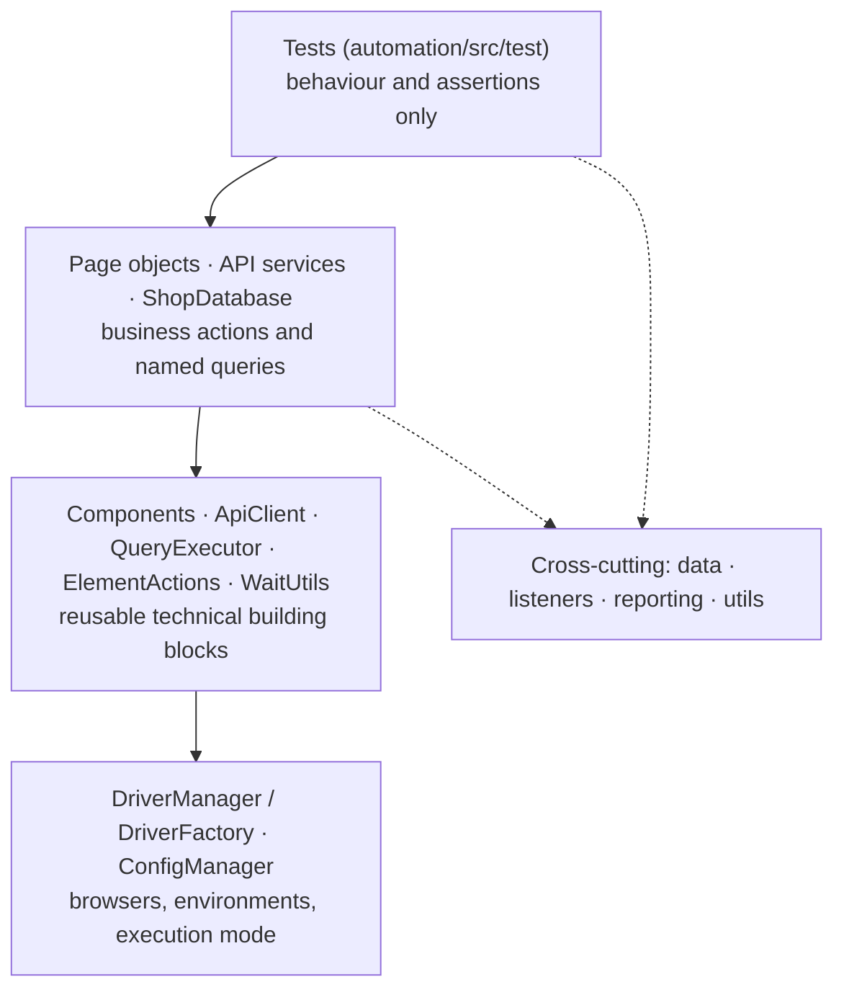

# Enterprise Test Automation Framework — Complete Guide

This guide describes the whole framework in one place: what it is, how it is built, how every part works, how to run it, how to read its results and how to extend it. The shorter documents in `docs/` go deeper on single topics and are linked where relevant.

**Contents**

1. [What this project is](#1-what-this-project-is)
2. [Quick start](#2-quick-start)
3. [Repository layout](#3-repository-layout)
4. [The application under test](#4-the-application-under-test)
5. [Architecture](#5-architecture)
6. [Configuration](#6-configuration)
7. [Browsers and the driver platform](#7-browsers-and-the-driver-platform)
8. [UI automation layer](#8-ui-automation-layer)
9. [API automation layer](#9-api-automation-layer)
10. [Database layer](#10-database-layer)
11. [Test data management](#11-test-data-management)
12. [Writing tests](#12-writing-tests)
13. [The test suite: what is covered](#13-the-test-suite-what-is-covered)
14. [Execution engine: suites, groups, parallelism, retries](#14-execution-engine-suites-groups-parallelism-retries)
15. [Logging](#15-logging)
16. [Reporting](#16-reporting)
17. [Docker and Selenium Grid](#17-docker-and-selenium-grid)
18. [CI/CD](#18-cicd)
19. [Quality gates and security](#19-quality-gates-and-security)
20. [Extending the framework](#20-extending-the-framework)
21. [Troubleshooting](#21-troubleshooting)
22. [Design decisions in brief](#22-design-decisions-in-brief)
23. [Class reference](#23-class-reference)
24. [Glossary](#24-glossary)

---

## 1. What this project is

A production-style test automation platform for a web application that has a **UI**, a **REST API** and a **database**. It shows how a team would build and run automated tests at scale:

- UI tests with Selenium (Page Objects composed of Component Objects, explicit waits only).
- API tests with REST Assured (service layer, typed models, JSON schema contracts, authentication and authorization).
- Database checks with plain JDBC (stored values, transactions, security of stored data).
- Cross-layer tests that follow one business record through UI, API and database.
- Test data that every test creates and removes itself, so tests are independent and parallel-safe.
- Parallel execution, a retry policy that only retries infrastructure failures, and rich failure evidence.
- An Allure report with steps, request/response attachments, SQL results, screenshots and per-test logs.
- Docker + Selenium Grid, and GitHub Actions pipelines for pull requests, the main branch and nightly regression.
- Quality gates (compiler warnings as errors, Checkstyle, dependency review) and secret handling.

| Area | Technology |
|---|---|
| Language / build | Java 17, Maven (multi-module) |
| Test runner | TestNG 7.12 |
| UI | Selenium 4.50 |
| API | REST Assured 6, Jackson, JSON Schema validator |
| Database | JDBC, H2 |
| Assertions | AssertJ |
| Test data | Datafaker, JSON, CSV |
| Logging | SLF4J + Logback |
| Reporting | Allure 3 (allure-testng) |
| Containers / CI | Docker, docker compose, Selenium Grid, GitHub Actions, Dependabot |

## 2. Quick start

Requirements: JDK 17 or newer, Maven 3.9+, Chrome or Edge (Selenium Manager downloads drivers, and can download Firefox). Node.js only for the Allure command line.

```bash
git clone https://github.com/niranjankagri/enterprise-test-automation-framework.git
cd enterprise-test-automation-framework

mvn clean test                                   # full suite; starts the demo app; Chrome
mvn clean test -Dsuite=smoke -Dheadless=true     # 20 fast checks
npx allure-commandline serve automation/target/allure-results   # open the report
```

Nothing else needs to be installed or started: for the default `local` environment the suite starts the application under test inside the test JVM.

Useful variations:

```bash
mvn clean test -Dbrowser=firefox -Dthreads=4     # another browser, more threads
mvn clean test -Dsuite=api                       # API only, no browser
mvn clean test -Dparallel=none -Dheadless=false  # serial, visible browser (debugging)
mvn clean test -Denv=qa                          # against an app started separately on port 8081
```

## 3. Repository layout

```text
enterprise-test-automation-framework/
├── pom.xml                       parent POM: every dependency/plugin version, compiler settings (-parameters, -Xlint)
├── demo-app/                     the application under test (Java, no framework)
│   ├── pom.xml                   builds target/demo-app.jar (shaded, runnable)
│   └── src/main
│       ├── java/com/enterprise/demoapp
│       │   ├── DemoApp.java      start-up, routes, options
│       │   ├── Database.java     in-memory H2 + optional TCP server
│       │   ├── Json.java         Jackson mapper
│       │   ├── auth/             login, tokens, password hashing
│       │   ├── http/             router, request/response, errors, static files
│       │   └── api/              customers, products, orders, users, stats endpoints
│       └── resources
│           ├── db/schema.sql     tables + seed data
│           └── static/           HTML pages, js/app.js, css/app.css
├── automation/                   the framework and the tests
│   ├── pom.xml                   dependencies, Checkstyle, Surefire (suite selection)
│   └── src
│       ├── main/java/com/enterprise/automation       the framework (packages in section 5)
│       ├── main/resources        config/*.properties, logback.xml, framework.properties, allure/categories.json
│       ├── test/java/com/enterprise/automation/tests the tests (api, ui, db, integration, e2e, platform, foundation, base)
│       └── test/resources        suites/*.xml, testdata/*, schemas/*, allure.properties
├── config/checkstyle.xml         code-quality rules
├── docker/                       Dockerfile, docker-compose.yml, README
├── docs/                         this guide and topic documents
├── .github/                      workflows/*.yml, dependabot.yml
├── .env.example                  every environment variable, without values
├── README.md, CONTRIBUTING.md, LICENSE
```

## 4. The application under test

**ShopEase Admin** is a small shop back office kept in `demo-app/`. It exists so the same data can be checked through UI, API and database, which no public demo site allows (their databases are not reachable and their shared data changes under the tests).

It is deliberately small and framework-free: the JDK's built-in HTTP server, plain JDBC on an in-memory H2 database, and Jackson.

### 4.1 Running it on its own

```bash
mvn -pl demo-app package
java -jar demo-app/target/demo-app.jar --port 8081 --db-port 9093
```

| Setting | Option / environment variable | Default |
|---|---|---|
| HTTP port | `--port` / `PORT` | 8080 |
| Database TCP port | `--db-port` / `DB_TCP_PORT` | 9092 (0 = none) |
| Accept database connections from other hosts | `DB_ALLOW_REMOTE` | false |
| Simulated API latency | `LATENCY_MS` | 100 ms |
| Demo passwords | `ADMIN_PASSWORD`, `VIEWER_PASSWORD` | `Admin@12345`, `Viewer@12345` |

Accounts: `admin` (role ADMIN, full access) and `viewer` (role VIEWER, read-only).

The 100 ms latency makes the UI behave like a real backend: data appears after a short delay, so tests must wait for the application's state instead of acting immediately.

### 4.2 Screens

| Page | What it offers | Signals for tests |
|---|---|---|
| `login.html` | username/password form; "required" messages; API error banner; info banner after logout or session expiry | test ids on fields, button, messages |
| `dashboard.html` | welcome message, 4 figures (customers, products, orders, revenue), 5 most recent orders | `body[data-page="dashboard"]`, `body[data-ready]` |
| `customers.html` | search; add, edit, delete (admins only) through dialogs; field errors from the API; toasts | table rows, dialog test ids, `error-<field>` slots |
| `products.html` | search, category filter, "Add to cart" | table, toasts, cart badge |
| `checkout.html` | cart lines with quantity and remove, total, customer select, "Place order" (admins only) | `quantity` inputs labelled per product, `order-total`, `checkout-error` |
| `orders.html` | status filter, order list, detail dialog, "Cancel order" for placed orders (admins) | toast "Order #N placed successfully" after checkout |

Every interactive element has a `data-testid`. Every signed-in page sets `body[data-page]` to its name and `body[data-ready="true"]` once its data is loaded; a loading bar (`data-testid="loader"`) is visible while API calls run. The cart lives in the browser tab's `sessionStorage`.

### 4.3 REST API

All endpoints except login need `Authorization: Bearer <token>`. Errors always have the shape `{status, error, message, path, timestamp, fieldErrors?}`, and every response carries an `X-Request-Id` header (the client's correlation id if it sent a safe one, otherwise a new UUID).

| Method | Path | Who | Behaviour |
|---|---|---|---|
| POST | `/api/auth/login` | anyone | `{username, password}` → `{token, tokenType: "Bearer", expiresIn: 3600, username, fullName, role}`; same 401 message for unknown user and wrong password |
| POST | `/api/auth/logout` | signed in | token stops working immediately |
| GET | `/api/stats` | signed in | customers, active products, orders, revenue (cancelled orders excluded) |
| GET | `/api/users/me` | signed in | the caller (never a password) |
| GET / POST | `/api/users` | ADMIN | list / create (password ≥ 8, role ADMIN or VIEWER, unique username) |
| GET / PATCH / DELETE | `/api/users/{id}` | ADMIN | read / change name or role / delete (not yourself) |
| GET / POST | `/api/customers` | GET signed in, POST ADMIN | `?search=` over name, email, city (case-insensitive); unique email (409) |
| GET / PUT / PATCH / DELETE | `/api/customers/{id}` | GET signed in, rest ADMIN | PUT replaces all fields; PATCH changes given ones; DELETE refused while the customer has orders (409) |
| GET / POST | `/api/products` | GET signed in, POST ADMIN | `?search=&category=&includeInactive=`; unique SKU (409) |
| GET / PUT / PATCH / DELETE | `/api/products/{id}` | GET signed in, rest ADMIN | DELETE deactivates (kept for order history) |
| GET / POST | `/api/orders` | GET signed in, POST ADMIN | `?customerId=&status=`, newest first; POST validates, checks stock, reserves it, computes totals — all in one transaction |
| GET / PATCH / DELETE | `/api/orders/{id}` | GET signed in, rest ADMIN | PATCH `{status}`: PLACED → SHIPPED → DELIVERED or PLACED → CANCELLED (cancel returns stock); DELETE removes (a placed order returns stock) |

Status codes used: 200, 201 (with `Location`), 204, 400 (validation, malformed JSON, non-numeric id), 401, 403, 404, 405, 409.

### 4.4 Database

Tables (`demo-app/src/main/resources/db/schema.sql`): `app_users` (salted SHA-256 password hashes), `customers`, `products`, `orders`, `order_items`. Seed data: 8 products in 4 categories and 3 customers. The database is recreated on every start.

Tests reach it through H2's TCP server: `jdbc:h2:tcp://localhost:<db-port>/mem:shop`, user `sa`, empty password.

## 5. Architecture



Rules that hold everywhere:

- **Dependencies point downwards only.** A page never knows a test; `config` knows nothing above it.
- **Tests contain no Selenium, HTTP or SQL.** Those live in pages/components, services and `ShopDatabase`.
- **Framework code is production code**: it lives in `src/main`, is compiled with warnings as errors in CI, and is checked by Checkstyle.
- **The framework never depends on the demo app.** Only the test code (`DemoAppLifecycle`) starts it, through a test-scoped dependency.

Framework packages (`automation/src/main/java/com/enterprise/automation`):

| Package | Responsibility |
|---|---|
| `config` | layered, immutable configuration |
| `driver` | browser options, creation (local / Grid), one browser per thread |
| `ui`, `ui.components`, `ui.pages` | waits and actions, component objects, page objects |
| `api`, `api.models`, `api.services` | HTTP client, request/response records, one service per resource |
| `db` | JDBC connection, parameterized queries, named queries, row assertions |
| `data` | data records, generators, factory, JSON/CSV readers, clean-up registry |
| `listeners` | execution settings, retry, log context, diagnostics, metadata, report evidence |
| `reporting` | report steps and attachments, per-test log capture, Allure run files, parameter masking |
| `utils` | waits, screenshots, failure classification |

The architecture decisions behind this are recorded as 15 ADRs in [architecture.md](architecture.md).

## 6. Configuration

### 6.1 How a value is resolved

For every setting the first non-blank value wins:

1. JVM system property: `-Dbrowser=edge`
2. Environment variable: `BROWSER=edge` (the property name upper-cased, `.` replaced by `_`)
3. The environment file: `automation/src/main/resources/config/<env>.properties`
4. `config/default.properties`

The environment itself is chosen with `-Denv=` or `ENV=` (default `local`). `ConfigLoader` does the resolution as a pure function (its inputs are maps, so it is unit-tested); `ConfigManager.config()` loads it once per JVM and returns an immutable `TestConfig` record shared by all threads. Every value is validated at start-up; a wrong value stops the run with a message that lists the valid values or says where to set the missing one.

### 6.2 Environments

| Environment | Application | Browser default | Database | Notes |
|---|---|---|---|---|
| `local` | started by the suite on 8080 (`app.autostart=true`) | visible Chrome | `jdbc:h2:tcp://localhost:9092/mem:shop` | developer machine |
| `qa` | already running on 8081 (jar or Docker) | headless | `...:9093/mem:shop` | CI, Docker Grid |
| `staging` | placeholder host; real URLs from CI | headless, remote | none (database tests skip) | passwords must come from secrets |

### 6.3 All settings

| Property | Variable | Default | Meaning |
|---|---|---|---|
| `base.url` | `BASE_URL` | per environment | URL of the web UI |
| `api.base.url` | `API_BASE_URL` | per environment | URL of the REST API |
| `browser` | `BROWSER` | `chrome` | `chrome`, `firefox`, `edge` |
| `headless` | `HEADLESS` | `false` (local) | run without a window |
| `execution` | `EXECUTION` | `local` | `local`, `remote` (Grid); `cloud` is reserved and fails fast |
| `grid.url` | `GRID_URL` | `http://localhost:4444` | Selenium Grid for `remote` |
| `window.width` / `window.height` | `WINDOW_WIDTH` / `WINDOW_HEIGHT` | 1440 × 900 | browser window size |
| `timeout.explicit.seconds` | `TIMEOUT_EXPLICIT_SECONDS` | 10 (qa 15, staging 20) | maximum wait for a UI condition |
| `timeout.page.load.seconds` | `TIMEOUT_PAGE_LOAD_SECONDS` | 30 | maximum page load |
| `app.autostart` | `APP_AUTOSTART` | `true` only for local | start the demo app in-process |
| `admin.username` / `admin.password` | `ADMIN_USERNAME` / `ADMIN_PASSWORD` | `admin` / demo password (local, qa) | full-access account |
| `viewer.username` / `viewer.password` | `VIEWER_USERNAME` / `VIEWER_PASSWORD` | `viewer` / demo password (local, qa) | read-only account |
| `db.url`, `db.username`, `db.password` | `DB_URL`, `DB_USERNAME`, `DB_PASSWORD` | per environment, optional | direct database access |
| `parallel` | `PARALLEL` | `classes` | `none`, `classes`, `methods`, `tests` |
| `threads` | `THREADS` | 2 | parallel threads |
| `retry.count` | `RETRY_COUNT` | 1 | extra attempts for infrastructure failures |

Secrets (passwords, database credentials) are never printed: `Credentials` and `DatabaseConfig` mask them in `toString()`, and `TestConfig.summary()` (logged at start) leaves them out. `.env.example` lists every variable.

## 7. Browsers and the driver platform

- **`BrowserOptionsFactory`** builds the options once per browser and uses them for local and Grid runs alike, so "works locally, fails on the Grid" cannot come from different flags. Chrome and Edge share Chromium arguments: new headless mode, `--disable-dev-shm-usage` (small `/dev/shm` in containers), no search-engine choice screen, no password manager and no password leak detection (Chrome's leak dialog swallows clicks and is invisible in screenshots), and `--no-sandbox` when `CI=true`.
- **`DriverFactory`** creates the session: `ChromeDriver` / `EdgeDriver` / `FirefoxDriver` locally (Selenium Manager finds or downloads drivers, and browsers if needed) or `RemoteWebDriver` against `grid.url`. It sets the page-load timeout and window size, never an implicit wait, and quits the session if that setup fails. `cloud` fails fast with the alternatives.
- **`DriverManager`** keeps one browser per thread in a `ThreadLocal`. `startDriver()` quits a leftover first and **retries start-up** (up to `retry.count`) when it fails for a transient reason (browser process exited, renderer stalled under load); configuration errors fail at once. `getDriver()` explains how to fix a missing browser; `quitDriver()` always clears the slot, even if `quit()` fails.

## 8. UI automation layer

```text
Test
 └─ Page (ui.pages)        LoginPage, DashboardPage, CustomerPage, ProductPage, CheckoutPage, OrderPage
     └─ Component           HeaderComponent, NavigationComponent, TableComponent, ModalComponent, ToastComponent
         └─ ElementActions + WaitUtils     every action waits for the right condition first
             └─ DriverManager             this thread's browser
```

- **Locators** are `data-testid` attributes via `TestId.of("customer-search")`, declared once as `private static final By` in their page or component.
- **Waiting**: `WaitUtils` is the only way to wait (100 ms polling, configurable timeout, stale/missing elements ignored while polling, readable timeout messages). There is no `Thread.sleep` and no implicit wait anywhere; Checkstyle enforces both.
- **Actions**: `ElementActions` waits before each click/type/select, retries a click whose element re-rendered, logs at DEBUG and creates a report step ("Type '****' into password").
- **Pages**: `BasePage` holds driver, waits and actions; `ShopPage<T>` adds header, navigation, toasts and the ready contract (`waitUntilLoaded()`: `body[data-page]` matches, `body[data-ready="true"]`, loader hidden). It is self-typed, so `open()` and `waitUntilLoaded()` return the concrete page for fluent calls. Navigation methods return the next page, already loaded.
- **Components** are scoped to a root element:
  - `TableComponent` reads rows as `Map<column, text>` (`table.row("Email", email).get("City")`), clicks buttons inside a row found by a column value, and treats the "empty" placeholder row as no rows.
  - `ModalComponent` finds fields by their visible label (label → `for` → input), fills inputs and selects, reads field errors, submits and cancels.
  - `ToastComponent` waits for a toast containing a text (toasts disappear after 5 s).
  - `HeaderComponent` reads the user and the exact cart count, opens the cart, logs out.
  - `NavigationComponent` opens every section and tells which one is highlighted.

```java
CheckoutPage checkout = loginAsAdmin().navigation().openProducts()
        .addToCart("Wireless Mouse")
        .header().openCart();
assertThat(checkout.total()).isEqualTo("$49.00");
```

## 9. API automation layer

```text
Test → ApiSession (account) → Service (one per resource) → ApiClient → REST API
```

- **`ApiClient`**: base URL from configuration, JSON in and out, optional bearer token, two filters (reporting, logging). Immutable (`withToken` returns a new client); every call builds a new request, with no REST Assured global state, so it is safe in parallel.
- **`ApiSession`**: the API as one account — `admin()`, `viewer()`, `as(credentials)`, `withToken(token)`, `anonymous()` — exposing `auth()`, `users()`, `customers()`, `products()`, `orders()` and the raw `client()`. Tokens are cached per username for the run (atomically, so parallel threads log in once).
- **Services** offer two kinds of methods: raw ones returning the REST Assured `Response` (`create`, `get`, `update`...) for status, header and error checks, and typed ones (`createCustomer`, `placeOrder`, `findByEmail`, `deleteCustomerIfExists`...) that check the expected status and return a record.
- **Models** (`api.models`) are records; requests omit `null` fields, responses ignore unknown fields (the contract is checked by schemas); records with secrets mask them in `toString()`.
- **`JsonMapper`**: the framework's own Jackson mapper (records, `Instant`, nulls omitted), independent of what REST Assured would detect.
- **`ApiAssertions`**: `expectStatus` (the failure message shows the masked body), `matchesSchema(response, "customer")` (strict JSON schemas in `src/test/resources/schemas`, `additionalProperties: false`), `error(response)` (checks the error schema and returns an `ErrorResponse`).
- **Logging and reporting**: `ApiLoggingFilter` writes `POST /api/customers -> 201 in 35 ms` and, at DEBUG, the bodies; `ReportingApiFilter` makes every call a report step with Request and Response attachments. Both mask secrets through `reporting.SecretMasker`.

```java
CustomerResponse created = ApiSession.admin().customers().createCustomer(TestDataFactory.newCustomer());

Response response = ApiSession.viewer().customers().create(CustomerRequest.from(customer));
ErrorResponse error = ApiAssertions.error(ApiAssertions.expectStatus(response, 403));
assertThat(error.message()).isEqualTo("This action needs the ADMIN role");
```

## 10. Database layer

- **`DatabaseConnection.fromConfig()`** opens connections from `db.*`. If the environment has no `db.url` it throws TestNG's `SkipException`; called from `@BeforeClass(alwaysRun = true)`, the whole class is reported as skipped with the reason.
- **`QueryExecutor`** runs only parameterized SQL (`?`, never string concatenation), returns rows as maps with lower-case column names, rejects several rows for a single-row query, counts, updates (for clean-up), opens one connection per query, and makes every query a report step ("DB: customer by email": `ShopDatabase` names every query with `named(...)`) with query name, SQL, parameters, database URL, duration and rows attached (password and salt columns masked). A failed query names the query and the database.
- **`ShopDatabase`** holds the application's named queries: `customerByEmail`, `customerById`, `productBySku`, `stockOf`, `orderById`, `orderItems`, `orderCountOf`, `userByUsername`, `deleteUnusedProduct`.
- **`DatabaseAssertions`**: `assertRow(row, "customer x").hasValue("city", "Pune").hasNonNull("created_at")` and `assertNoRow(...)`; numbers are compared by value (10.5 = 10.50); failure messages show the whole row.

```java
ShopDatabase db = ShopDatabase.fromConfig();
assertRow(db.customerByEmail(email), "customer " + email).hasValue("status", "ACTIVE");
assertThat(db.stockOf("ACC-3002")).isEqualTo(148);
```

## 11. Test data management

| Need | Where it comes from |
|---|---|
| New, unique, valid data | `TestDataFactory.newCustomer()`, `newProduct()`, `newUser(role)` |
| A specific variant | `newCustomer().withEmail("bad")`, `newProduct().withStock(5)`: records are immutable, `with...` returns a changed copy |
| Reference data | `testdata/products.json` → `TestDataFactory.catalogue()`, `catalogueProduct(sku)` |
| Expected values | computed from data: `OrderData.total()`, `displayTotal()`, `itemCount()`; `ProductData.displayPrice()` |
| Data-driven cases | CSV files read by `CsvDataReader`, exposed as TestNG DataProviders in `TestDataProviders` |

**Uniqueness.** `RandomDataGenerator.uniqueSuffix()` = start time of the JVM in base 36 + an atomic counter shared by all threads. Emails (`first.last.<suffix>@test.example.com`, a reserved domain), SKUs (`TST-<SUFFIX>`) and usernames never collide, not in parallel and not across runs. Names and cities come from Datafaker (one `Faker` per thread); names are reduced to letters so emails stay valid.

**Data files** (`automation/src/test/resources/testdata`):

| File | Content | Used by |
|---|---|---|
| `products.json` | the 8 seeded products | catalogue tests in UI, API and database |
| `invalid-customers.csv` | 8 invalid form inputs and their exact messages | UI form test and API validation test (the same rules in both layers) |
| `login-negative.csv` | 5 rejected sign-ins | UI login test |

CSV files have a header line, `#` comments, and quoted values for text with commas. The first column is a readable case name that appears in the report.

**Clean-up.** Every test registers the removal of what it creates right after creating it:

```java
CustomerResponse created = admin().customers().createCustomer(data);
CleanupRegistry.register("delete customer " + created.id(),
        () -> admin().customers().deleteCustomerIfExists(created.id()));
```

The registry is per thread; `BaseTest` / `BaseApiTest` run it after every test, newest first (an order before its customer). Clean-ups are idempotent ("already gone" is fine) and never fail the test: exceptions and assertion errors are logged and counted. UI tests set up and clean up through the API; only the behaviour under test goes through the UI.

## 12. Writing tests

### 12.1 Base classes

| Class | For | Provides |
|---|---|---|
| `BaseTest` | UI and cross-layer tests | a fresh browser per test (`@BeforeMethod`), clean-ups then browser quit (`@AfterMethod`), `config()`, `openLoginPage()`, `loginAsAdmin()`, `loginAsViewer()` |
| `BaseApiTest` | API and API→DB tests | `admin()`, `viewer()`, `anonymous()` sessions, `config()`, clean-ups after each test |
| `DemoAppLifecycle` | every suite (listener) | starts the demo app once when `app.autostart=true` |
| `TestDataProviders` | data-driven tests | `loginNegative`, `invalidCustomers`, `catalogue`, `categories` |

All set-up and tear-down methods use `alwaysRun = true`, so they also run in suites that select tests by group.

### 12.2 Conventions

- One behaviour per test, named as behaviour: `duplicateEmailGives409`, `viewerCannotPlaceOrders`.
- Arrange → act → assert, separated by blank lines and explained by short comments.
- AssertJ, with `.as("...")` where the intent is not obvious.
- Groups on every test: a layer (`unit`, `platform`, `api`, `ui`, `db`, `integration`, `e2e`) and, where it applies, a purpose (`smoke`, `sanity`, `regression`, `security`). Class-level `@Test(groups = ...)` makes every public method a test; method-level groups are added.
- Never assert on what other tests may change in parallel (global counts, "the 5 most recent orders", the full product list including `TST-` products): assert on the test's own data or the seeded catalogue (`ProductPage.catalogueRows()`).

### 12.3 A complete UI test

```java
@Test(groups = {"ui", "regression"})
public class CustomerManagementTest extends BaseTest {

    public void adminCreatesACustomer() {
        CustomerData customer = TestDataFactory.newCustomer();
        CustomerPage customers = loginAsAdmin().navigation().openCustomers();

        customers.addCustomer(customer);

        assertThat(customers.search(customer.email()).table().row("Email", customer.email()))
                .containsEntry("City", customer.city());
    }
}
```

### 12.4 A complete API test

```java
@Test(groups = {"api", "regression"})
public class CustomerApiTest extends BaseApiTest {

    public void duplicateEmailGives409() {
        CustomerResponse existing = admin().customers().createCustomer(TestDataFactory.newCustomer());
        CleanupRegistry.register("delete " + existing.id(), () -> admin().customers().deleteCustomerIfExists(existing.id()));

        Response response = admin().customers().create(
                CustomerRequest.from(TestDataFactory.newCustomer().withEmail(existing.email())));

        assertThat(ApiAssertions.error(ApiAssertions.expectStatus(response, 409)).fieldErrors())
                .containsEntry("email", "Email is already in use");
    }
}
```

## 13. The test suite: what is covered

169 tests in the full suite (some data-driven methods run once per data row).

| Class | Layer | What it proves |
|---|---|---|
| `FrameworkFoundationTest` | unit | the build filters the framework's name and version |
| `ConfigLoaderTest` | unit | every precedence rule, environment switching, secrets required for staging, masking, fail-fast validation |
| `TestDataTest` | unit | 500 customers generated in parallel are valid and unique; JSON/CSV readers; order totals; clean-up order and failure tolerance |
| `ExecutionEngineTest` | unit | which failures are transient (retried) and which are real; execution settings; run metadata without secrets |
| `SecretMaskingTest` | unit, security | passwords, tokens and bearer headers are masked everywhere |
| `DriverManagerTest` | platform | the configured browser starts with its settings; 4 sessions on 2 threads are all distinct; quit releases the browser |
| `ScreenshotUtilsTest` | platform | a real PNG is written; a dead browser gives no screenshot instead of an error |
| `LoginSmokeTest`, `NavigationSmokeTest`, `CatalogSmokeTest` | ui, smoke | sign in/out, every menu section, dashboard figures, customer search, product search and filter, cart |
| `LoginRegressionTest` | ui | 5 rejected sign-ins (CSV), viewer role, redirect to login without a session |
| `CustomerManagementTest` | ui | create, optional fields, edit, delete, cancel, 8 invalid inputs (CSV), duplicate email, viewer restrictions |
| `ProductCatalogTest` | ui | every reference product listed correctly, every category filter, empty search |
| `CheckoutTest` | ui | empty cart, quantities drive the total, removing items, customer required, viewer cannot order |
| `AuthApiTest` | api | login and token, 401 variants, logout revokes, viewer read-only (403), `/users/me` without password |
| `CustomerApiTest` | api | full CRUD, headers, search, PUT vs PATCH, 8 invalid inputs (same CSV), duplicates, customers with orders, 404/400/405 |
| `ProductApiTest` | api | catalogue vs reference data, create/patch/put, soft delete, validation, duplicate SKU |
| `OrderApiTest` | api | totals, stock reservation, status flow, cancel returns stock, over-ordering rolls back, validation, unknown references, inactive customer, viewer |
| `UserApiTest` | api | created users sign in with their role, promotion, validation, no self-deletion, deleted users cannot sign in |
| `DatabaseLayerTest` | db | schema, catalogue rows, parameters bound (SQL injection text harmless), assertion messages |
| `ApiToDatabaseTest` | integration | API writes stored exactly; order rows/lines/stock; cancel/delete return stock; rejected order leaves no trace; salted password hashes |
| `UiApiDatabaseTest` | integration, e2e | API → DB → UI for a customer; UI → API → DB for an edit; UI order → API → DB lines and stock |
| `PurchaseJourneyTest` | e2e | login → search → cart → checkout → verify order (list and details); cancelling an order |

The test strategy behind this (pyramid, techniques, entry/exit criteria) is in [test-strategy.md](test-strategy.md).

## 14. Execution engine: suites, groups, parallelism, retries

### 14.1 Suites

Suite files (`automation/src/test/resources/suites`) select **what** runs; `-Dsuite=<name>` picks one (default `full`).

| Suite | Groups | Tests | Purpose |
|---|---|---|---|
| `full` | all | 169 | everything |
| `unit` | `unit` | 32 | fast framework checks; first CI gate |
| `smoke` | `smoke` | 20 | "is it up and usable"; pull-request gate |
| `sanity` | `sanity` | 11 | key happy paths and role checks after a deployment |
| `regression` | `regression` | 121 | complete functional coverage |
| `api` | `api` | 57 | API only |
| `ui` | `ui` | 53 | browser tests |
| `integration` | `integration`, `db` | 22 | database and cross-layer |
| `e2e` | `e2e` | 5 | business journeys |

Every suite declares the same listeners: `ExecutionSettingsListener`, `RetryTransformer`, `TestLogContextListener`, `FailureDiagnosticsListener`, `ReportEvidenceListener`, `ExecutionMetadataListener`, `DemoAppLifecycle`. Do not run single tests with Maven's `-Dtest=...`: it bypasses the suite files and therefore the listeners.

### 14.2 Parallel execution

**How** tests run comes from configuration: `ExecutionSettingsListener` applies `parallel` and `threads` to whichever suite runs. The supported mode is `classes` (a class runs on one thread; classes run in parallel). Isolation that makes this safe: one browser per thread, unique data, per-thread clean-ups, immutable configuration, a stateless API client, a connection per query, and assertions that ignore other tests' data. Measured: full suite ~186 s serial, ~132 s with 2 threads, ~118 s with 4. Details: [parallel-execution.md](parallel-execution.md).

### 14.3 Retries

Only transient infrastructure failures are retried, at most `retry.count` times:

- `RetryTransformer` attaches `RetryAnalyzer` to every test; `RetryAnalyzer` asks `TransientFailures.isTransient(...)`.
- Transient: session not created, session lost, browser unreachable, connection refused/reset, socket timeouts, Chromium renderer stalled at start-up (checked through the whole cause chain; messages are trusted only on IO and Selenium exceptions).
- Never retried: assertion failures (even with a network cause), wait timeouts, missing elements, unexpected HTTP statuses.
- Browser start-up in `@BeforeMethod` is retried by `DriverManager` with the same rule.
- A retried attempt is reported as skipped and logged with its cause, so retries stay visible.

## 15. Logging

- SLF4J API everywhere; Logback (`automation/src/main/resources/logback.xml`) writes INFO to the console and DEBUG to `automation/target/logs/automation.log`.
- Every line (console and file) carries time, level, thread, test and component, and is masked:
  `00:10:03.180 INFO  [TestNG-test-Full-3] [CustomerApiTest.duplicateEmailGives409] [API] POST /api/customers -> 409 in 41 ms [X-Request-Id 6f1c...]`.
  The test name comes from the MDC (`TestLogContextListener`; set-up/clean-up methods are tagged with their own name, e.g. `CustomerApiTest.cleanUp`), the component from the logger's package (`LogComponent`: UI, API, DB, DRIVER, CONFIG, DATA, TEST, APP, LIB), so parallel logs can be filtered per test and per layer.
- Per test: `START` (with parameters, secrets masked), `PASS` / `FAIL` / `SKIP` with duration.
- Per failure: a `FAILURE DIAGNOSTICS` block (test, parameters, groups, thread, duration, environment, browser, retry candidate or not, cause).
- Per API call: one line with method, path, status, duration and correlation id; bodies at DEBUG with secrets masked. `ApiClient` sends a new `X-Request-Id` with every call (`withRequestId(...)` fixes it); the application logs and returns the same id, so a call can be followed from the test into the application's log, even when it fails without a response.
- At start: the configuration summary and run metadata; at the end: the suite's result counts.

## 16. Reporting

Allure results are written to `automation/target/allure-results`:

```bash
npx allure-commandline serve automation/target/allure-results
npx allure-commandline generate automation/target/allure-results -o automation/target/allure-report --clean
```

What a test shows, without any reporting code in the test:

| Evidence | Produced by |
|---|---|
| A step per click, typed value (passwords `****`), selection, form fill, navigation | `ElementActions`, `ModalComponent`, `BasePage` |
| A step per API call with Request and Response attachments (secrets masked) | `ReportingApiFilter` |
| A step per database query: name, SQL, parameters, database, duration, rows (hash/salt masked) | `QueryExecutor` |
| Screenshot, page URL, page source and browser console (Chrome/Edge) of a failed UI test (screenshot also saved under `target/screenshots`) | `ReportEvidenceListener` (right after the test method, before the browser is quit) |
| The test's own log lines | `TestLogAppender` + `ReportEvidenceListener` |
| Labels: epic = layer, feature = class, tags = groups | `ReportEvidenceListener` |
| Parameters of data-driven tests, secret ones masked | Allure + `ParameterMasking` |
| Environment panel (environment, URLs, browser, execution, parallelism, Java, OS, framework version, Git commit, build number/URL) | `ExecutionMetadata` → `AllureRunFiles` |
| Executor (local run or CI build with a link) and failure categories (configuration, infrastructure, timeout, authentication/authorization, database, UI, API, assertion, test/framework error, skipped; rules in [reporting.md](reporting.md#failure-categories)) | `AllureRunFiles` |

Steps use Allure's lambda API (`Report.step`) instead of `@Step` annotations: the AspectJ weaver that `@Step` needs does not run on JDK 27, and annotated steps would silently disappear. Details: [reporting.md](reporting.md).

## 17. Docker and Selenium Grid

```bash
docker compose -f docker/docker-compose.yml up --build --abort-on-container-exit --exit-code-from tests
SUITE=regression BROWSER=firefox THREADS=4 docker compose -f docker/docker-compose.yml up --build --abort-on-container-exit --exit-code-from tests
```

- `docker/Dockerfile` has three stages from one build: `build` (compiles once; POMs and `config/` copied before sources for layer caching), `app` (the demo app on a JRE image; port 8081, database port 9093 open to other containers) and `tests` (`mvn test`, `ENV=qa`, `EXECUTION=remote`, suite via the command).
- `docker/docker-compose.yml` runs the app (health-checked), a Selenium hub (healthy only when a node can start sessions), Chrome, Firefox and Edge nodes (2 sessions each), and the tests, which wait for both health checks. Inside the network browsers reach the app as `http://app:8081`, so `BASE_URL`, `API_BASE_URL` and `DB_URL` are overridden there. `--exit-code-from tests` makes failed tests fail the command; results land in `automation/target` on the host.
- Without Docker, any Grid works: `java -jar selenium-server-<version>.jar standalone`, then `mvn test -Dexecution=remote -Dgrid.url=http://localhost:4444 -Dbrowser=firefox`.

## 18. CI/CD

| Workflow | Trigger | Jobs |
|---|---|---|
| `ci.yml` | pull request, manual | quality gate (compile with warnings as errors, Checkstyle, unit suite) → smoke; dependency review; Allure report |
| `regression.yml` ("Main") | push to `main`, manual | build (+ app jar artifact) → API (4 threads) → UI (4 threads) → smoke on Edge → report |
| `nightly.yml` | 02:00 UTC daily, manual | full suite on Chrome, regression on Firefox (4 threads) and Edge (2 threads), regression on Docker + Grid → report |
| `run-suite.yml` | reusable | one suite on Java 17 with Maven cache; uploads results even when tests fail |
| `allure-report.yml` | reusable | merges all `results-*` artifacts into one Allure report artifact |

Failed tests fail the job; evidence is uploaded with `if: always()`. Artifacts: `results-<run>` (Allure results, screenshots, logs, metadata, Surefire reports; 14 days), `allure-report` (30 days), `demo-app-jar` (7 days). Dependabot opens grouped weekly update PRs for Maven and Actions (Surefire is held on 3.5.x: 3.6 drops TestNG suite files). Details: [ci-cd.md](ci-cd.md).

## 19. Quality gates and security

| Gate | Fails the build when |
|---|---|
| Compilation | code does not compile; in CI also on any compiler warning |
| Checkstyle (`config/checkstyle.xml`, every build) | star/unused/redundant imports, empty catch or blocks, missing braces, several statements per line, missing `@Override`, equals without hashCode, `Thread.sleep`, `implicitlyWait`, `System.out/err` |
| Tests | any test fails |
| Dependency review (PRs) | a new dependency has a known high-severity vulnerability (needs the repository's Dependency graph setting) |

Security measures:

- No credentials, tokens or keys in code or Git history (scanned); real secrets come from environment variables or CI secrets; `.env` is ignored and `.env.example` documents the variables.
- The demo passwords in `local`/`qa` files belong to the self-hosted demo app and are documented as public; `staging` commits none and fails fast without them.
- Masked everywhere: records with secrets (`toString()`), API bodies and `Authorization` headers in logs and attachments, typed password fields in report steps, secret-named test parameters (thanks to `-parameters`), password/salt columns in SQL attachments. A scan of a full run's report and log found no password.
- The application stores salted hashes; `ApiToDatabaseTest.passwordsAreStoredHashedAndSalted` verifies it. Unknown user and wrong password give the same 401 message.

## 20. Extending the framework

| To add | Do this |
|---|---|
| A page | `ui/pages/XxxPage extends ShopPage<XxxPage>` with `pageId()` and `path()`; locators as `TestId.of(...)` constants; business methods built from `actions` and components; navigation returns loaded pages |
| A component | extend `BaseComponent` with its root locator; look children up with `child(...)` |
| An API resource | records in `api.models` (`from(XxxData)`, masked `toString()` if secrets), `XxxService extends BaseService` with raw + typed methods, expose it in `ApiSession`, add a strict schema in `schemas/` |
| Test data | a record + `TestDataFactory.newXxx()` (valid and unique by default); CSV/JSON files + a DataProvider for data-driven cases |
| A database check | a named query in `ShopDatabase`; `ShopDatabase.fromConfig()` in `@BeforeClass(alwaysRun = true)` |
| A setting | `ConfigKey` + field in `TestConfig` + resolution/validation in `ConfigLoader` + default in `default.properties` + a `ConfigLoaderTest` case |
| A suite | a file in `suites/` with the same listeners and the groups to include |
| A transient failure type | add it to `TransientFailures` and pin it in `ExecutionEngineTest` |

More detail and the listener hook points: [framework-design.md](framework-design.md). Coding rules: [coding-standards.md](coding-standards.md).

## 21. Troubleshooting

| Symptom | What to do |
|---|---|
| `Unknown environment` / `Unknown browser` | use one of the values the message lists |
| `Configuration 'admin.password' is not set` | set `ADMIN_PASSWORD` / `VIEWER_PASSWORD` (secrets) |
| Port 8080 or 9092 in use | stop the other process, or run `-Denv=qa` against a separately started app |
| Database tests skipped | the environment has no `db.url`; expected for staging |
| `SessionNotCreatedException`, "Chrome instance exited", renderer timeout | browser start-up problem; retried automatically once; on CI `--no-sandbox` is added; check the Grid UI at `:4444/ui` |
| `TimeoutException: Expected condition failed: ...` | the UI never reached that state: read the condition, the screenshot and the page source; never add a sleep |
| Clicks ignored on Chrome after signing in | keep the password-manager preferences in `BrowserOptionsFactory` |
| Number input does not change on Firefox | use the End + Backspace pattern of `CheckoutPage.setQuantity` |
| Passes alone, fails in parallel | shared state or assertions on shared lists; keep `parallel=classes` and assert on own data |
| Checkstyle or `-Werror` failure | fix the reported rule/warning (`mvn compile` without `-q` shows warnings) |
| Empty Allure report | results are in `automation/target/allure-results` |

Full table: [troubleshooting.md](troubleshooting.md). To debug: `mvn test -Dsuite=ui -Dparallel=none -Dheadless=false` and read `automation/target/logs/automation.log` top to bottom.

## 22. Design decisions in brief

| # | Decision | Why |
|---|---|---|
| 1 | Multi-module Maven | one place for versions; the app under test as its own module |
| 2 | Self-hosted application under test | the only way to check UI, API and database with the same data, deterministically |
| 3 | Framework in `src/main`, tests in `src/test` | framework code treated as production code |
| 4 | SLF4J + Logback | standard facade; thread and test in every line |
| 5 | Layered, immutable configuration | one code base for laptop, CI and Docker; validated at start |
| 6 | One browser per thread | parallel safety; creation and ownership separated |
| 7 | Pages composed of components | each locator once; reusable parts |
| 8 | Wait for real state, never for time | fast and stable; the app exposes test hooks |
| 9 | Every test owns its data | independent, parallel-safe tests on any environment |
| 10 | Raw responses and typed results | negative tests see everything, happy paths stay short |
| 11 | Plain JDBC, optional per environment | raw stored values; skip where access is not allowed |
| 12 | Idempotent clean-ups that never fail a test | results reflect behaviour, not bookkeeping |
| 13 | Suites say what, configuration says how | eight small suites instead of a matrix |
| 14 | Retry infrastructure, report everything else | honest signal |
| 15 | Evidence collected by the framework | no reporting code in tests; works on every JDK; secrets masked |

Each is written out (problem, options, decision, reason, trade-offs) in [architecture.md](architecture.md).

## 23. Class reference

### Framework (`automation/src/main/java/com/enterprise/automation`)

| Class | Purpose |
|---|---|
| `FrameworkInfo` | framework name and version from the Maven build |
| `config.ConfigKey` | every setting, with property and environment-variable names |
| `config.ConfigLoader` | resolves settings through all layers, validates them |
| `config.ConfigManager` | the run's configuration, loaded once |
| `config.TestConfig` | immutable configuration record (+ `summary()`) |
| `config.BrowserType`, `ExecutionMode` | browser and execution enums with readable parsing errors |
| `config.Credentials`, `DatabaseConfig`, `ExecutionSettings` | account, database and orchestration settings |
| `driver.BrowserOptionsFactory` | Chrome/Edge/Firefox options |
| `driver.DriverFactory` | creates local or remote sessions |
| `driver.DriverManager` | one browser per thread, start-up retry |
| `ui.TestId` | `data-testid` locators |
| `ui.ElementActions` | waited actions with report steps |
| `ui.BasePage`, `ui.BaseComponent` | technical bases of pages and components |
| `ui.components.*` | Table, Modal, Toast, Header, Navigation components |
| `ui.pages.*` | ShopPage (shared layout, ready contract), Login, Dashboard, Customer, Product, Checkout, Order pages |
| `api.ApiClient` | HTTP client |
| `api.ApiSession` | services per account, token cache |
| `api.ApiAssertions` | status, schema and error checks |
| `api.JsonMapper` | the framework's JSON mapper |
| `api.ApiLoggingFilter`, `ReportingApiFilter` | logging, report attachments, masking |
| `api.services.*` | Auth, User, Customer, Product, Order services (+ BaseService) |
| `api.models.*` | request and response records, ErrorResponse |
| `db.DatabaseConnection`, `QueryExecutor`, `ShopDatabase`, `DatabaseAssertions` | database access and checks |
| `data.CustomerData`, `ProductData`, `OrderData`, `UserData` | test-data records |
| `data.RandomDataGenerator`, `TestDataFactory` | unique, realistic data |
| `data.JsonDataReader`, `CsvDataReader` | data files |
| `data.CleanupRegistry` | per-thread undo actions |
| `listeners.*` | ExecutionSettings, Retry (Analyzer, Transformer), TestLogContext, FailureDiagnostics, ExecutionMetadata (+Listener), ReportEvidence |
| `reporting.Report`, `TestLogAppender`, `AllureRunFiles`, `SecretMasker`, `ParameterMasking`, `MaskingConverter` | report steps, per-test log, run files, masking (one utility for logs, reports and metadata) |
| `utils.WaitUtils`, `ScreenshotUtils`, `TransientFailures` | waits, screenshots, failure classification |

### Application under test (`demo-app/src/main/java/com/enterprise/demoapp`)

| Class | Purpose |
|---|---|
| `DemoApp` | start-up (options, database, accounts, routes, HTTP server) |
| `Database` | in-memory H2, schema script, TCP server |
| `Json` | Jackson mapper |
| `auth.AuthService` | users with salted hashes, login, tokens, logout, token checks |
| `http.Router` | routes, access control, error bodies, request ids, latency |
| `http.Request`, `Response`, `ApiException`, `StaticFiles` | request access, responses, errors, UI files |
| `api.CustomerApi`, `ProductApi`, `OrderApi`, `UserApi`, `StatsApi` | endpoints |
| `api.Validator`, `Sql` | field validation, JDBC helpers and transactions |

## 24. Glossary

| Term | Meaning |
|---|---|
| ADR | architecture decision record: problem, options, decision, reason, trade-offs |
| Component object | a reusable part of a page (table, dialog...) with its own locators, scoped to a root element |
| Data provider | TestNG method that supplies rows of parameters to a test |
| E2E | end-to-end: a business journey through the real UI |
| Explicit wait | waiting for a condition with a timeout (the only kind used) |
| Grid | Selenium Grid: browsers on other machines/containers, reached with `RemoteWebDriver` |
| Group | TestNG label on a test (`smoke`, `api`...) used by suites to select tests |
| Idempotent clean-up | a clean-up that succeeds also when there is nothing left to remove |
| MDC | logging context per thread (here: the running test's name) |
| Page object | a class representing one screen: its locators and business actions |
| Ready contract | `body[data-page]` + `body[data-ready]` + hidden loader = page loaded |
| Schema | JSON Schema describing the exact shape of an API response |
| Transient failure | an infrastructure failure (browser, Grid, network) that may not happen again on another attempt |
