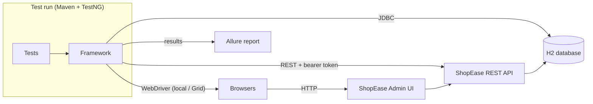
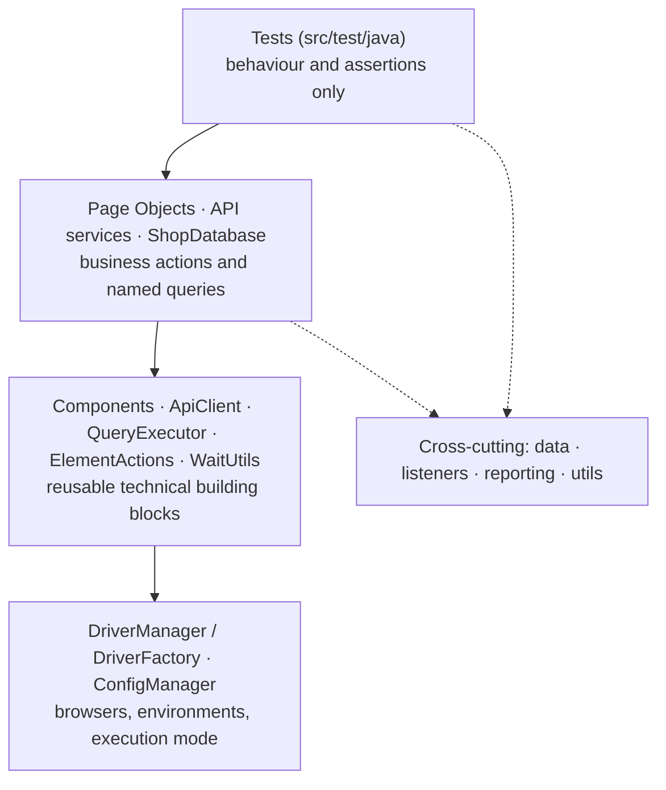
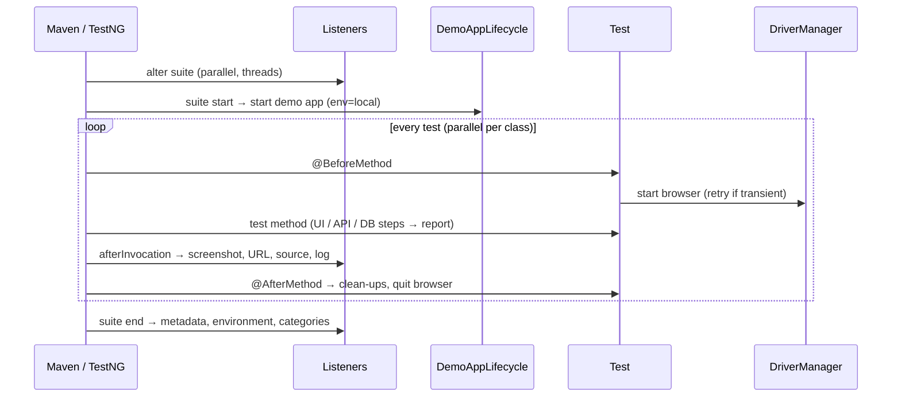

# Architecture

How the framework is put together, and why. The decisions behind it are recorded as ADRs in [docs/adr](adr/README.md), indexed at the end of this document.

## System context

The application under test (`demo-app`) exposes the same business data through three doors: UI, API and database. The framework can therefore check one record through all three ([ADR-002](adr/ADR-002-a-self-hosted-application-under-test.md)).

## Layers

Dependencies only point downwards. A page never knows about a test, and `config` knows about nothing above it. That keeps every layer replaceable and testable on its own.

| Package (`com.enterprise.automation`) | Responsibility |
|---|---|
| `config` | layered, immutable configuration: environment, browser, execution, accounts, database, parallelism |
| `driver` | browser options, creation (local / Grid), one browser per thread, start-up retry |
| `ui`, `ui.components`, `ui.pages` | waits and actions, component objects, page objects |
| `api`, `api.models`, `api.services` | HTTP client, request/response records, one service per resource, sessions per account |
| `db` | JDBC connection, parameterized queries, named queries, row assertions |
| `data` | data records, generators, factory, JSON/CSV readers, clean-up registry |
| `listeners` | execution settings, retry, log context, failure diagnostics, run metadata, report evidence |
| `reporting` | report steps and attachments, per-test log capture, Allure run files, parameter masking |
| `utils` | waits, screenshots, failure classification |

## Run time view

## Decisions

Each major decision is an architecture decision record in [docs/adr](adr/README.md), written as
Problem → Options → Decision → Reason → Trade-offs.

| ADR | Decision |
|---|---|
| [ADR-001](adr/ADR-001-multi-module-maven-build.md) | Multi-module Maven build |
| [ADR-002](adr/ADR-002-a-self-hosted-application-under-test.md) | A self-hosted application under test |
| [ADR-003](adr/ADR-003-framework-code-in-src-main-tests-in-src-test.md) | Framework code in `src/main`, tests in `src/test` |
| [ADR-004](adr/ADR-004-slf4j-logback-for-logging.md) | SLF4J + Logback for logging |
| [ADR-005](adr/ADR-005-layered-immutable-configuration.md) | Layered, immutable configuration |
| [ADR-006](adr/ADR-006-one-browser-per-thread.md) | One browser per thread |
| [ADR-007](adr/ADR-007-page-objects-composed-of-component-objects.md) | Page Objects composed of Component Objects |
| [ADR-008](adr/ADR-008-wait-for-the-application-s-real-state-never-for-time.md) | Wait for the application's real state, never for time |
| [ADR-009](adr/ADR-009-every-test-owns-its-data.md) | Every test owns its data |
| [ADR-010](adr/ADR-010-api-services-return-raw-responses-and-typed-results.md) | API services return raw responses and typed results |
| [ADR-011](adr/ADR-011-database-checks-through-plain-jdbc-optional-per-environment.md) | Database checks through plain JDBC, optional per environment |
| [ADR-012](adr/ADR-012-clean-ups-are-idempotent-and-never-fail-a-test.md) | Clean-ups are idempotent and never fail a test |
| [ADR-013](adr/ADR-013-suites-say-what-runs-configuration-says-how.md) | Suites say what runs, configuration says how |
| [ADR-014](adr/ADR-014-retry-infrastructure-report-everything-else.md) | Retry infrastructure, report everything else |
| [ADR-015](adr/ADR-015-report-evidence-is-collected-by-the-framework-not-by-tests.md) | Report evidence is collected by the framework, not by tests |
| [ADR-016](adr/ADR-016-selenium-webdriver-and-testng.md) | Selenium WebDriver and TestNG |
| [ADR-017](adr/ADR-017-rest-assured-for-api-testing.md) | REST Assured for API testing |
| [ADR-018](adr/ADR-018-allure-for-reporting.md) | Allure for reporting |
| [ADR-019](adr/ADR-019-docker-and-selenium-grid.md) | Docker and Selenium Grid for remote execution |
| [ADR-020](adr/ADR-020-github-actions-for-ci-cd.md) | GitHub Actions for CI/CD |
| [ADR-021](adr/ADR-021-cloud-execution-deferred.md) | Cloud browser execution is deferred, and will use one provider |
