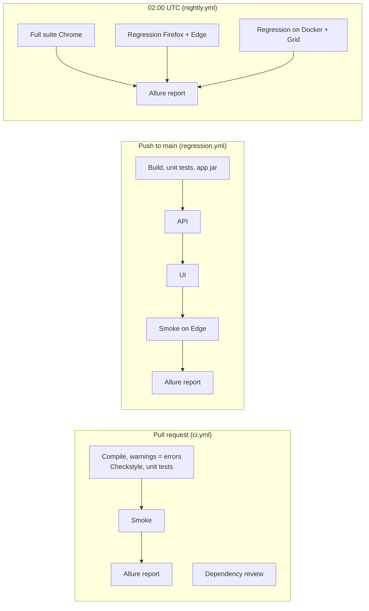

# CI/CD

GitHub Actions, in `.github/workflows`.

## Pipelines

| Workflow | Trigger | Jobs |
|---|---|---|
| `ci.yml` | pull request, manual | quality gate (compile with warnings as errors, Checkstyle, unit suite) → smoke; dependency review in parallel; report |
| `regression.yml` | push to `main`, manual | build (+ app jar artifact) → API → UI → smoke on Edge → report |
| `nightly.yml` | daily 02:00 UTC, manual | full suite on Chrome (4 threads), regression on Firefox and Edge, regression through `docker compose` + Selenium Grid; combined report |
| `run-suite.yml` | reusable | one suite: Java 17 + Maven cache, `mvn test -Dsuite=... -Dbrowser=... -Dthreads=...`, results uploaded even on failure |
| `allure-report.yml` | reusable | downloads all `results-*` artifacts, merges Allure results, generates one report artifact |

Shared steps live in the two reusable workflows, so the three pipelines differ only in what they run.

## Quality gates

| Gate | Where | Fails the build when |
|---|---|---|
| Compilation | every job | code does not compile; in CI also on any compiler warning (`-Dmaven.compiler.failOnWarning=true`) |
| Code quality | every Maven build (`validate`) | Checkstyle finds a violation (`config/checkstyle.xml`) |
| Test results | every test job | any test fails (Maven exit code) |
| Dependencies | pull requests | a new dependency has a known high-severity vulnerability (`dependency-review-action`; needs the repository's Dependency graph enabled) |
| Updates | weekly | Dependabot opens grouped update PRs that go through the gates above |

## Artifacts

| Artifact | Content | Kept |
|---|---|---|
| `results-<run>` | Allure results, screenshots, logs, execution metadata, Surefire reports | 14 days |
| `allure-report` | the generated, merged HTML report | 30 days |
| `demo-app-jar` | the application under test (main pipeline) | 7 days |

Evidence is uploaded with `if: always()`: a failed run is exactly when it is needed.

## Secrets

The demo application needs none. For real environments set `ADMIN_PASSWORD`, `VIEWER_PASSWORD`, `DB_URL`/`DB_USERNAME`/`DB_PASSWORD`, `BASE_URL`/`API_BASE_URL` as repository secrets or variables and pass them as `env` to the test step; the framework reads environment variables directly (see `.env.example`).

## Running a pipeline manually

All three pipelines have `workflow_dispatch`: Actions tab → workflow → "Run workflow".
