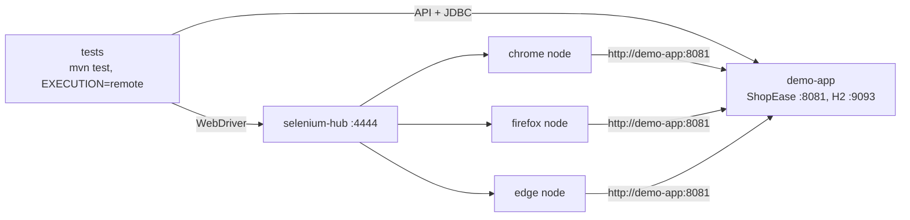

# Docker

The whole test platform runs in containers: the application under test, a Selenium Grid and the test runner. No Java, Maven or browser is needed on the machine, only Docker. Selenium Grid itself is described in [grid.md](grid.md).

## Run

```bash
# from the repository root: build, start everything, run the smoke suite, stop when the tests finish
docker compose -f docker/docker-compose.yml up --build --abort-on-container-exit --exit-code-from tests

# another suite, browser or thread count
SUITE=regression BROWSER=firefox THREADS=4 docker compose -f docker/docker-compose.yml up --build --abort-on-container-exit --exit-code-from tests

# remove the containers and the network
docker compose -f docker/docker-compose.yml down
```

- `--exit-code-from tests`: the command's exit code is the test runner's, so a failed test fails the command (and a pipeline).
- `--abort-on-container-exit`: the application and Grid stop as soon as the tests finish.
- Results are written to `automation/target` on the host (volume): `allure-results`, `screenshots`, `logs`. Open the report with `npx allure-commandline serve automation/target/allure-results`.

| Variable | Default | Meaning |
|---|---|---|
| `SUITE` | `smoke` | suite file from `automation/src/test/resources/suites` |
| `BROWSER` | `chrome` | `chrome`, `firefox` or `edge` (all three nodes always run) |
| `THREADS` | `2` | parallel test threads |
| `SELENIUM_IMAGE_TAG` | `latest` | tag of the Selenium hub and node images; pin it for reproducible runs |

## Images: one Dockerfile, three stages

`docker/Dockerfile` (build context: the repository root):

| Stage | Base | Content | Used as |
|---|---|---|---|
| `build` | `maven:3.9-eclipse-temurin-17` | POMs first (dependency layer cached until a POM changes), then `config/` (Checkstyle rules) and sources; `mvn package` + `test-compile` | base of `tests`; source of the app jar |
| `app` | `eclipse-temurin:17-jre` | `demo-app.jar` only; `PORT=8081`, `DB_TCP_PORT=9093`, `DB_ALLOW_REMOTE=true` | the `demo-app` service |
| `tests` | `build` | compiled framework and tests; `ENV=qa`, `HEADLESS=true`, `EXECUTION=remote`; entry point `mvn -B test`, default `-Dsuite=smoke` | the `tests` service |

Build a single image:

```bash
docker build -f docker/Dockerfile --target app   -t shop-app .
docker build -f docker/Dockerfile --target tests -t shop-tests .
```

The Checkstyle quality gate runs inside the image build too, so the container builds exactly what CI builds.

## Services (`docker/docker-compose.yml`)



| Service | Ports (host) | Ready when | Notes |
|---|---|---|---|
| `demo-app` | 8081, 9093 | TCP port 8081 accepts connections (healthcheck) | database reachable from other containers for the database checks |
| `selenium-hub` | 4444 (Grid UI at `http://localhost:4444/ui`) | `/status` reports `"ready": true`, i.e. a node can start sessions | |
| `chrome`, `firefox`, `edge` | none | registered at the hub | 2 sessions each, `shm_size: 2gb` (browsers crash with Docker's default 64 MB `/dev/shm`) |
| `tests` | none | starts after `demo-app` and `selenium-hub` are healthy | `ENV=qa` with URLs pointing at the `demo-app` service |

The test runner overrides the application URLs: inside the Docker network the browsers reach the application as `http://demo-app:8081`, not `localhost` (in a node container, `localhost` is the node itself). `DB_URL=jdbc:h2:tcp://demo-app:9093/mem:shop` lets the database checks read the application's database.

## In CI

The nightly workflow runs the regression suite this way on Firefox with 4 threads (job "Regression on Docker + Selenium Grid"), prints the `demo-app` and `selenium-hub` logs when it fails, always runs `docker compose down`, gives the result files back to the runner user, and uploads Allure results, screenshots and logs as `results-grid-firefox`. See [ci-cd.md](ci-cd.md).

## Troubleshooting

| Symptom | Cause | Fix |
|---|---|---|
| `tests` exits immediately with a build error | compilation or Checkstyle failed in the `build` stage | run `mvn -q test-compile` locally to see the error |
| Tests cannot reach the application (`ERR_CONNECTION_REFUSED` in screenshots) | a URL points at `localhost` | inside compose use `http://demo-app:8081` (already set in `docker-compose.yml`) |
| Chrome/Edge pages time out (`ERR_TIMED_OUT`, "Timed out receiving message from renderer") while API tests pass | the service name is a real top-level domain on the HSTS preload list (for example `app`), so the browser forces HTTPS | name services so they are not a TLD (this is why the service is `demo-app`) |
| `SessionNotCreatedException` / tests wait long for a browser | no node for the browser, or all sessions busy | check `http://localhost:4444/ui`; more threads than node sessions queue (see [grid.md](grid.md#capacity-and-parallel-sessions)) |
| Browser tabs crash in nodes | too little shared memory | keep `shm_size: 2gb` on the nodes |
| Port 8081, 9093 or 4444 already in use | a local app or Grid is running | stop it, or remove the `ports:` mapping (only needed to look from the host) |
| Database tests skipped | `DB_URL` not set | keep `DB_URL` in the `tests` service |
| `permission denied` reading `automation/target` afterwards (Linux) | the test container runs as root and Allure 3 writes owner-only files | `sudo chown -R "$(id -u):$(id -g)" automation/target` (the nightly workflow does this before uploading) |
