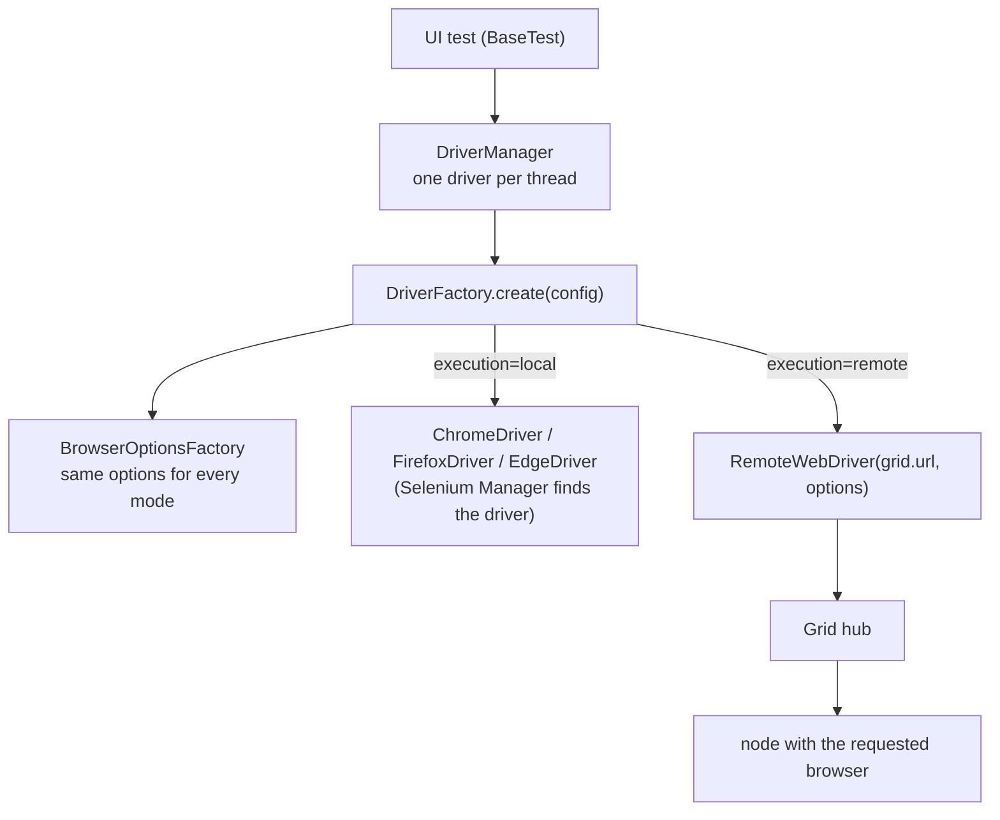

# Selenium Grid

The same tests run on a local browser or on a Selenium Grid; one setting switches between them. Containers for the Grid are described in [docker.md](docker.md).

## How the driver is chosen



- **One browser definition.** `BrowserOptionsFactory` builds the options (headless, page-load strategy, password-manager prefs, console logging) once; local drivers and the Grid get identical options, so "works locally, fails on the Grid" cannot come from different flags.
- **Only the connection differs.** `DriverFactory` creates a local driver or a `RemoteWebDriver` pointing at `grid.url`; the Grid picks a node offering the requested browser.
- **Thread confinement is unchanged.** `DriverManager` keeps one driver per test thread (`ThreadLocal`), whether it is local or remote, and retries start-up on transient failures (busy or restarting node), up to `retry.count` times.

## Configuration

| Setting | Property | Environment variable | Default |
|---|---|---|---|
| Where browsers run | `execution` (`local`, `remote`, `cloud`) | `EXECUTION` | `local` |
| Grid address | `grid.url` | `GRID_URL` | `http://localhost:4444` |
| Browser | `browser` (`chrome`, `firefox`, `edge`) | `BROWSER` | `chrome` |
| Parallel threads | `threads` | `THREADS` | `2` |

`cloud` fails fast with "Cloud execution is not implemented"; cloud providers are out of scope (see the README).

## Run against a Grid

```bash
# 1. Whole platform in containers (app + hub + Chrome/Firefox/Edge nodes + tests)
docker compose -f docker/docker-compose.yml up --build --abort-on-container-exit --exit-code-from tests

# 2. A one-machine Grid without Docker (browsers on this machine reach the local app as localhost)
java -jar selenium-server-<version>.jar standalone --port 4444
mvn clean test -Dexecution=remote -Dgrid.url=http://localhost:4444 -Dbrowser=firefox
```

The Grid's own UI (`http://localhost:4444/ui`) shows nodes, free slots and running sessions.

## Capacity and parallel sessions

Each node in `docker-compose.yml` offers 2 sessions (`SE_NODE_MAX_SESSIONS=2`), so the Grid has 2 Chrome, 2 Firefox and 2 Edge slots. Test threads use only the requested browser's slots:

| Threads | Browser slots | Behaviour |
|---|---|---|
| ≤ 2 | 2 | every thread gets a browser at once |
| > 2 | 2 | extra session requests wait in the Grid's queue until a slot is free; results stay correct, the run is slower |

For more parallelism, raise `SE_NODE_MAX_SESSIONS` (memory permitting) or scale a node: `docker compose -f docker/docker-compose.yml up --scale chrome=3 ...`. Parallel safety does not depend on the Grid: every test has its own driver, its own data and its own log/screenshot names ([parallel-execution.md](parallel-execution.md)).

## Validated

| Run | Where | Result |
|---|---|---|
| Regression, Firefox, 4 threads, Docker Grid | nightly workflow | green (121/121) |
| Smoke on Chrome, Firefox and Edge, 4 threads, Selenium standalone server 4.50 | local machine, 2026-10-07 | green (20/20 each) |
| Full suite on a local browser, 4 threads | every local run / CI | green |

## Troubleshooting

| Symptom | Likely cause | What to do |
|---|---|---|
| `SessionNotCreatedException: Could not start a new session` | no node offers the browser, or the hub is not ready | check `/ui`; wait for the hub healthcheck; check `-Dbrowser` |
| `Connection refused` to `:4444` | Grid not running or wrong `grid.url` | start it; check `GRID_URL` |
| Pages fail to load on the Grid only | the browser (in a container) cannot reach the URL | use an address the node can resolve (`http://demo-app:8081` inside compose; `localhost` means the node itself) |
| Long pauses before tests start | more threads than free slots | lower `THREADS` or add capacity (above) |
| Browser console missing in a Firefox failure | geckodriver has no console log | expected; Chrome and Edge attach it |
